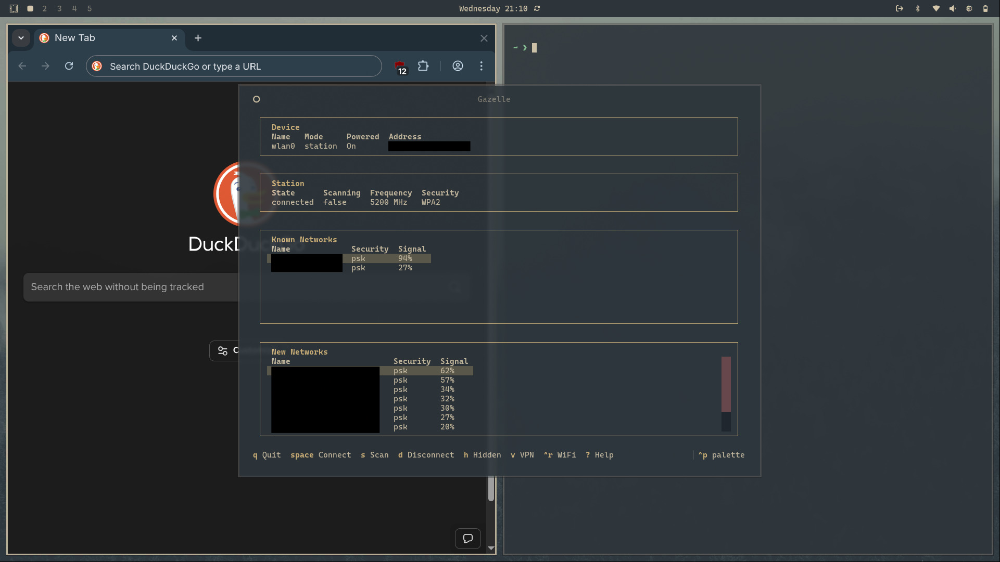

# Gazelle

A minimal NetworkManager TUI for Linux with **complete 802.1X enterprise WiFi support**.



## Why Gazelle?

A minimal, keyboard-driven TUI for NetworkManager with **full 802.1X enterprise WiFi support**. Perfect for connecting to eduroam, corporate networks, and regular WiFi from the terminal.

## Installation

### From AUR (Recommended)

```bash
yay -S gazelle-tui
# or
paru -S gazelle-tui
```

### From GURU (Gentoo)

[Documentation on GURU](https://wiki.gentoo.org/wiki/Project:GURU/Information_for_End_Users)

```bash
$ # If you don't have GURU enabled already, you need to add it to your system.
$ sudo eselect repository enable guru

$ sudo emerge --ask net-misc/gazelle-tui::guru
```

Then just run:

```bash
gazelle
```

#### ⚠️ Note for Omarchy Linux Users

If you get "target not found" errors for `python-textual`, `python-rich`, or `python-platformdirs`, your mirrors may be behind on Python packages. Use this **safe workaround**:

```bash
# Add official Arch mirrors (temporary)
sudo sed -i '1iServer = https://geo.mirror.pkgbuild.com/$repo/os/$arch' /etc/pacman.d/mirrorlist
sudo pacman -Syy

# Now install gazelle
yay -S gazelle-tui
```

**Why this is safe:**

- Omarchy uses official Arch repositories, this just adds the source directly
- Your Omarchy-specific packages are unaffected
- Temporary fix until Omarchy mirrors sync (typically 1-7 days)
- You can optionally remove the added line later with `sudo sed -i '/geo.mirror.pkgbuild.com/d' /etc/pacman.d/mirrorlist`

### On Nix

#### **1. Using Home Manager (recommended)**

Add the Gazelle flake to your user flake:

```nix
inputs.gazelle.url = "github:Zeus-Deus/gazelle-tui";
```

Then enable it in your `homeConfigurations`:

```nix
modules = [
  gazelle.homeModules.gazelle
];
```

Don't forget to add the package as well:

```nix
    home.packages =  [
      inputs.gazelle.packages.${pkgs.system}.default
    ];
```

You can use Home Manager to declaratively configure Gazelle:

```nix
programs.gazelle = {
  enable = true;
  settings = {
    theme = "nord"; # choose your theme
  };
```

Home Manager will automatically generate:

```
~/.config/gazelle/config.json
```

with your chosen settings.

Apply the configuration:

```bash
home-manager switch
```

or rebuild your flake

```bash
nixos-rebuild switch --flake .#myFlake
```

---

#### **2. Running the App Manually**

Build and run with Nix:

```bash
nix build github:Zeus-Deus/gazelle-tui
./result/bin/gazelle
```

Or run directly with `nix run`:

```bash
nix run github:Zeus-Deus/gazelle-tui
```

---

### Development Setup

For contributing or testing the latest version:

```bash
git clone https://github.com/Zeus-Deus/gazelle-tui.git
cd gazelle-tui
pip install -r requirements.txt
chmod +x gazelle
./gazelle
```

## Omarchy Integration

To integrate Gazelle as your WiFi TUI in Omarchy (replacing Impala):

### Step 1: Install Gazelle

```bash
# Temporarily add Arch mirrors (Omarchy mirror sync issue)
sudo sed -i '1iServer = https://geo.mirror.pkgbuild.com/$repo/os/$arch' /etc/pacman.d/mirrorlist
sudo pacman -Syy

# Install from AUR
yay -S gazelle-tui
```

### Step 2: Choose Your Configuration Method

**Important:** Omarchy changed how terminals are launched in November 2025 (version ~3.1.5+). Choose the configuration that matches your Omarchy version:

- **Omarchy versions before November 2025** → Use **Old Style** configuration
- **Omarchy versions from November 2025 onwards** → Use **New Style** configuration

#### Old Style (Pre-November 2025 Omarchy)

For older Omarchy versions that launch terminals directly:

**Configure Hyprland Window Rules:**

Create a window rules configuration file:

```bash
cat > ~/.config/hypr/windows.conf << 'EOF'
# Gazelle WiFi TUI - floating window
# New Hyprland Syntax
windowrule = tag +floating-window, match:class Gazelle
EOF
```

Add the source line to your Hyprland config:

```bash
echo "source = ~/.config/hypr/windows.conf" >> ~/.config/hypr/hyprland.conf
```

**Update Waybar Network Module:**

Edit `~/.config/waybar/config.jsonc` and change the network module's `on-click`:

```jsonc
"network": {
    ...
    "on-click": "$TERMINAL --class=Gazelle -e gazelle"
}
```

#### New Style (November 2025+ Omarchy)

For newer Omarchy versions that use `xdg-terminal-exec`:

**Configure Hyprland Window Rules:**

Create a window rules configuration file:

```bash
cat > ~/.config/hypr/windows.conf << 'EOF'
# Gazelle WiFi TUI - floating window
# New Hyprland Syntax using match:initial_class (xdg-terminal-exec friendly)
windowrule = float on, center on, size 800 600, match:initial_class Gazelle
EOF
```

Add the source line to your Hyprland config (if not already present):

```bash
echo "source = ~/.config/hypr/windows.conf" >> ~/.config/hypr/hyprland.conf
```

**Update Waybar Network Module:**

Edit `~/.config/waybar/config.jsonc` and change the network module's `on-click`:

```jsonc
"network": {
    ...
    "on-click": "xdg-terminal-exec --app-id=Gazelle -e gazelle"
}
```

**Why the change?**

- Omarchy now uses `xdg-terminal-exec` as a universal terminal launcher
- `xdg-terminal-exec` uses `--app-id` instead of `--class` for window identification
- Hyprland's `windowrulev2` with `initialClass` is required for proper window matching

### Step 3: Apply Changes

```bash
# Reload Hyprland configuration
hyprctl reload

# Restart Waybar
killall waybar && waybar &
```

Now clicking the WiFi icon in Waybar will launch Gazelle as a centered, floating 800x600 window on top of all other windows - exactly like Impala worked.

### What This Does

**Old Style:** The `floating-window` tag automatically applies these rules (defined in Omarchy's system config):

- `float` - Window floats instead of tiling
- `center` - Centered on screen
- `size 800 600` - Fixed size matching other Omarchy TUIs

**New Style:** The `windowrule` rules explicitly define:

- `float` - Window floats instead of tiling
- `center` - Centered on screen
- `size 800 600` - Fixed size matching other Omarchy TUIs

### Reverting to nm-applet

If you want to go back to nm-applet, change the waybar network `on-click` to:

```json
"on-click": "nm-applet --indicator"
```

## Features

- ✅ **WWAN/Cellular Support** - Manage 4G/5G modem connections with live signal monitoring
- ✅ **Complete 802.1X Support** (PEAP/TTLS/TLS with all phase2 auth methods)
- ✅ **VPN Connection Management** - Connect/disconnect OpenVPN and WireGuard VPNs
- ✅ **Theme Persistence** - Your theme choice is saved and restored between sessions
- ✅ **Automatic Omarchy theme integration**
- ✅ **Hidden SSID Networks** - Connect to networks that don't broadcast
- ✅ **WPA3-OWE Support** - Enhanced Open (encrypted open networks)
- ✅ Connect to regular WiFi (WPA/WPA2/WPA3-PSK)
- ✅ Connect to enterprise WiFi (eduroam, corporate networks)
- ✅ Scan for networks
- ✅ Auto-connect to known networks in range
- ✅ Toggle WiFi on/off
- ✅ Clean 4-section layout (Device, Station, Known Networks, New Networks)

## 802.1X Enterprise WiFi

Gazelle supports **all common enterprise authentication methods**:

**EAP Methods:**

- PEAP (most common, used by eduroam)
- TTLS
- TLS (certificate-based)

**Phase 2 Authentication:**

- MSCHAPv2 (most common)
- MSCHAP
- PAP
- CHAP
- GTC
- MD5

When connecting to an 802.1X network, simply select your authentication method from the dropdowns.

## Keybindings

- `j`/`k` or `↓`/`↑` - Move cursor
- `Tab` - Switch between Known/New Networks sections
- `Space` - Connect to selected network
- `s` - Scan for networks
- `h` - Connect to hidden network
- `v` - VPN connections
- `w` - WWAN/Cellular connections
- `d` - Disconnect
- `Ctrl+R` - Toggle WiFi on/off
- `Ctrl+P` - Command palette (themes, etc.)
- `?` - Show help
- `q` - Quit

## Themes

### Automatic Theme Matching (Omarchy)

Gazelle automatically detects and matches your Omarchy theme colors!

**How it works:**

- Omarchy users: Gazelle reads `~/.config/omarchy/current/theme/alacritty.toml` and uses your exact theme colors
- Theme changes: Just restart Gazelle after changing Omarchy themes
- No configuration needed!

**Supported:**

- All Omarchy themes (nord, mars, gruvbox, catppuccin, tokyo-night, etc.)
- Colors update automatically when you switch themes

### Non-Omarchy Users

If Omarchy is not detected, Gazelle uses standard ANSI terminal colors that work with any color scheme.

### Manual Theme Override

To use a specific theme regardless of Omarchy:

1. Press `Ctrl+P` (command palette)
2. Search for "theme"
3. Select your preferred theme

Note: Manual theme selection is saved and persists across restarts.

## Theme Customization

Gazelle supports all built-in Textual themes with automatic persistence.

**Changing Theme:**

1. Press `Ctrl+P` to open the command palette
2. Type "theme" and select from available themes
3. Your selection is automatically saved to `~/.config/gazelle/config.json`
4. Theme persists across app restarts

**Available Themes:**

- textual-dark (default)
- textual-light
- nord
- dracula
- monokai
- gruvbox
- catppuccin
- tokyo-night
- ...and many more!

**Config File Location:** `~/.config/gazelle/config.json`

## Custom Themes

Create your own color schemes by editing `~/.config/gazelle/theme.toml`. The file is automatically generated with commented examples on first run.

Your custom theme appears as "user-theme" in the theme picker (`Ctrl+P`).

## Connecting to eduroam

1. Select eduroam network (shows as "802.1x" in Security column)
2. Press Space
3. Choose EAP Method: **PEAP** (default)
4. Choose Phase 2: **MSCHAPv2** (default)
5. Enter username (e.g., `user@university.edu`)
6. Enter password
7. Connect!

The connection is saved and will auto-reconnect when in range.

## Connecting to Hidden Networks

Many corporate/enterprise networks hide their SSID for security.

1. Press `h` (Hidden)
2. Enter the network name (SSID)
3. Select security type (Open/WPA2/802.1X)
4. Enter credentials if needed
5. Connect!

## WPA3-OWE (Enhanced Open)

Gazelle automatically detects and connects to OWE networks (shown as "owe" in Security column). These are encrypted open networks that provide better security than traditional open WiFi. NetworkManager handles the encryption automatically - just connect like any open network.

## VPN Support (Phase 1)

Gazelle now supports managing VPN connections directly from the TUI!

**Phase 1 Features (v1.5+):**

- List all configured VPN connections
- Connect/disconnect with keyboard
- Visual status indicators (🟢 connected, ⚪ disconnected)
- Press `v` to open VPN screen

### Setting Up VPN Connections

Phase 1 requires pre-configured VPN connections. Here's how to set them up:

**1. Import VPN Config**

```
sudo nmcli connection import type openvpn file your-vpn.ovpn
```

**2. Store Credentials (optional - prevents password prompts)**

```
sudo nmcli connection modify <vpn-name> \
    vpn.user-name "YOUR_USERNAME" \
    vpn.secrets "password=YOUR_PASSWORD" \
    +vpn.data "password-flags=0"
```

**For NordVPN users:** Get service credentials from [nordaccount.com/manual-configuration](https://my.nordaccount.com/dashboard/nordvpn/manual-configuration/service-credentials/) (not your regular login)

**3. Use Gazelle**

- Press `v` to open VPN screen
- Use `Enter` or `Space` to connect/disconnect
- Press `j`/`k` to navigate, `r` to refresh

### WireGuard VPN Setup

**1. Import WireGuard Configuration**

The `.conf` file must have a valid interface name (e.g., `wg0.conf`):

```bash
sudo nmcli connection import type wireguard file /path/to/wg0.conf
```

**2. Disable Auto-Connect (optional)**

By default, WireGuard connections auto-connect at boot. To disable:

```bash
nmcli connection modify wg0 autoconnect no
```

**3. Manual Connection Control**

Connect:

```bash
nmcli connection up wg0
```

Disconnect:

```bash
nmcli connection down wg0
```

**4. Use Gazelle**

Once imported, your WireGuard connection appears in Gazelle's VPN screen:

- Press `v` to open VPN screen
- Select your WireGuard connection
- Use `Enter` or `Space` to connect/disconnect

**Phase 2 Coming:** Import `.ovpn` files directly from Gazelle, edit connections, and more advanced features. See [Issue #3](https://github.com/Zeus-Deus/gazelle-tui/issues/3) for roadmap.

## WWAN/Cellular Support

Gazelle now supports managing cellular (4G/5G) modem connections!

**Features:**

- List all configured GSM connections
- Connect/disconnect with keyboard
- Live signal strength monitoring
- Operator and technology display (LTE, 5G, etc.)
- Visual status indicators (🟢 connected, ⚪ disconnected)
- Press `w` to open WWAN screen

### Hardware Compatibility

Gazelle's WWAN support works with **any cellular modem supported by ModemManager**, including:

- ✅ **Qualcomm modems** (QMI protocol) - Sierra Wireless, Quectel, etc.
- ✅ **MediaTek modems** (MBIM protocol) - T700, T750, T770, etc.
- ✅ **Intel modems** (MBIM) - XMM series
- ✅ **Huawei modems** (AT commands, QMI)
- ✅ **Ericsson/Telit modems**
- ✅ Any modem with QMI, MBIM, or AT command support

**Protocol agnostic**: Gazelle uses ModemManager's abstraction layer, so it works with all supported protocols automatically.

### Requirements

**Software dependencies:**

- ModemManager (provides `mmcli` command)
- NetworkManager (provides `nmcli` command)

**Hardware requirements:**

- Compatible cellular modem (USB, M.2, or PCIe)
- Linux kernel with appropriate WWAN drivers
- Active SIM card with data plan

**Compatible distributions:**

- Arch Linux (tested)
- Ubuntu/Debian
- Fedora/RHEL
- openSUSE
- Any systemd-based Linux distribution

### Setting Up WWAN Connections

WWAN connections are typically auto-configured by ModemManager, but you can also create them manually:

**1. Check if modem is detected:**

```bash
mmcli -L  # List modems
mmcli -m 0  # Show modem details
```

**2. Create GSM connection (if not auto-created):**

```bash
nmcli connection add type gsm ifname "*" con-name "My Carrier" apn "internet"
```

Replace `"internet"` with your carrier's APN (e.g., `"fast.t-mobile.com"` for T-Mobile US).

**3. Use Gazelle:**

- Press `w` to open WWAN screen
- Select your connection
- Use `Space` to connect/disconnect
- Press `r` to refresh status
- Navigate with `j`/`k`

### Troubleshooting

**No modems detected:**

```bash
# Check if ModemManager sees your modem
mmcli -L

# Check if kernel driver loaded
lsusb | grep -i modem  # For USB modems
```

**Connection fails:**

- Verify APN settings for your carrier
- Check SIM card is inserted and unlocked
- Ensure you're in an area with cellular coverage

**No ModemManager service:**

```bash
sudo systemctl enable --now ModemManager
```

## NetworkManager Integration

Gazelle uses real NetworkManager commands (`nmcli`) - the same backend as:

- GNOME Network Settings
- KDE Network Manager
- nmtui

All connections are stored in `/etc/NetworkManager/` and persist across reboots.

## Requirements

**Core dependencies:**

- Linux with NetworkManager
- Python 3.8+
- textual>=0.47.0

**Optional (for specific features):**

- ModemManager - Required for WWAN/cellular support
- networkmanager-openvpn - Required for OpenVPN support
- wireguard-tools - Required for WireGuard support

## License

MIT
