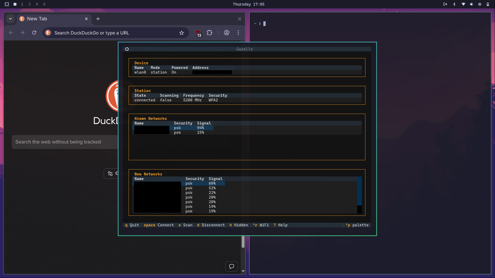

# Gazelle

A minimal NetworkManager TUI for Linux with **complete 802.1X enterprise WiFi support**.



## Why Gazelle?

A minimal, keyboard-driven TUI for NetworkManager with **full 802.1X enterprise WiFi support**. Perfect for connecting to eduroam, corporate networks, and regular WiFi from the terminal.

## Installation

### From AUR (Recommended)

```bash
yay -S gazelle-tui
# or
paru -S gazelle-tui
```

Then just run:
```bash
gazelle
```

#### ⚠️ Note for Omarchy Linux Users

If you get "target not found" errors for `python-textual`, `python-rich`, or `python-platformdirs`, your mirrors may be behind on Python packages. Use this **safe workaround**:

```bash
# Add official Arch mirrors (temporary)
sudo sed -i '1iServer = https://geo.mirror.pkgbuild.com/$repo/os/$arch' /etc/pacman.d/mirrorlist
sudo pacman -Syy

# Now install gazelle
yay -S gazelle-tui
```

**Why this is safe:**
- Omarchy uses official Arch repositories, this just adds the source directly
- Your Omarchy-specific packages are unaffected
- Temporary fix until Omarchy mirrors sync (typically 1-7 days)
- You can optionally remove the added line later with `sudo sed -i '/geo.mirror.pkgbuild.com/d' /etc/pacman.d/mirrorlist`

### Development Setup

For contributing or testing the latest version:

```bash
git clone https://github.com/Zeus-Deus/gazelle-tui.git
cd gazelle-tui
pip install -r requirements.txt
chmod +x gazelle
./gazelle
```

## Omarchy Integration

To integrate Gazelle as your WiFi TUI in Omarchy (replacing Impala):

### Step 1: Install Gazelle

```bash
# Temporarily add Arch mirrors (Omarchy mirror sync issue)
sudo sed -i '1iServer = https://geo.mirror.pkgbuild.com/$repo/os/$arch' /etc/pacman.d/mirrorlist
sudo pacman -Syy

# Install from AUR
yay -S gazelle-tui
```

### Step 2: Configure Hyprland Window Rules

Create a window rules configuration file:

```bash
cat > ~/.config/hypr/windows.conf << 'EOF'
# Gazelle WiFi TUI - floating window like Impala
windowrule = tag +floating-window, class:(Gazelle)
EOF
```

Add the source line to your Hyprland config:

```bash
echo "source = ~/.config/hypr/windows.conf" >> ~/.config/hypr/hyprland.conf
```

### Step 3: Update Waybar Network Module

Edit `~/.config/waybar/config.jsonc` and change the network module's `on-click`:

```json
"network": {
    ...
    "on-click": "$TERMINAL --class=Gazelle -e gazelle"
}
```

### Step 4: Apply Changes

```bash
# Reload Hyprland configuration
hyprctl reload

# Restart Waybar
killall waybar && waybar &
```

Now clicking the WiFi icon in Waybar will launch Gazelle as a centered, floating 800x600 window on top of all other windows - exactly like Impala worked.

### What This Does

The `floating-window` tag automatically applies these rules (defined in Omarchy's system config):
- `float` - Window floats instead of tiling
- `center` - Centered on screen
- `size 800 600` - Fixed size matching other Omarchy TUIs

### Reverting to nm-applet

If you want to go back to nm-applet, change the waybar network `on-click` to:
```json
"on-click": "nm-applet --indicator"
```

## Features

- ✅ **Complete 802.1X Support** (PEAP/TTLS/TLS with all phase2 auth methods)
- ✅ **VPN Connection Management** - Connect/disconnect OpenVPN and WireGuard VPNs
- ✅ **Theme Persistence** - Your theme choice is saved and restored between sessions
- ✅ **Hidden SSID Networks** - Connect to networks that don't broadcast
- ✅ **WPA3-OWE Support** - Enhanced Open (encrypted open networks)
- ✅ Connect to regular WiFi (WPA/WPA2/WPA3-PSK)
- ✅ Connect to enterprise WiFi (eduroam, corporate networks)
- ✅ Scan for networks
- ✅ Auto-connect to known networks in range
- ✅ Toggle WiFi on/off
- ✅ Clean 4-section layout (Device, Station, Known Networks, New Networks)

## 802.1X Enterprise WiFi

Gazelle supports **all common enterprise authentication methods**:

**EAP Methods:**
- PEAP (most common, used by eduroam)
- TTLS
- TLS (certificate-based)

**Phase 2 Authentication:**
- MSCHAPv2 (most common)
- MSCHAP
- PAP
- CHAP
- GTC
- MD5

When connecting to an 802.1X network, simply select your authentication method from the dropdowns.

## Keybindings

- `j`/`k` or `↓`/`↑` - Move cursor
- `Tab` - Switch between Known/New Networks sections
- `Space` - Connect to selected network
- `s` - Scan for networks
- `h` - Connect to hidden network
- `v` - VPN connections
- `d` - Disconnect
- `Ctrl+R` - Toggle WiFi on/off
- `Ctrl+P` - Command palette (themes, etc.)
- `?` - Show help
- `q` - Quit

## Theme Customization

Gazelle supports all built-in Textual themes with automatic persistence.

**Changing Theme:**
1. Press `Ctrl+P` to open the command palette
2. Type "theme" and select from available themes
3. Your selection is automatically saved to `~/.config/gazelle/config.json`
4. Theme persists across app restarts

**Available Themes:**
- textual-dark (default)
- textual-light
- nord
- dracula
- monokai
- gruvbox
- catppuccin
- tokyo-night
- ...and many more!

**Config File Location:** `~/.config/gazelle/config.json`

## Connecting to eduroam

1. Select eduroam network (shows as "802.1x" in Security column)
2. Press Space
3. Choose EAP Method: **PEAP** (default)
4. Choose Phase 2: **MSCHAPv2** (default)
5. Enter username (e.g., `user@university.edu`)
6. Enter password
7. Connect!

The connection is saved and will auto-reconnect when in range.

## Connecting to Hidden Networks

Many corporate/enterprise networks hide their SSID for security.

1. Press `h` (Hidden)
2. Enter the network name (SSID)
3. Select security type (Open/WPA2/802.1X)
4. Enter credentials if needed
5. Connect!

## WPA3-OWE (Enhanced Open)

Gazelle automatically detects and connects to OWE networks (shown as "owe" in Security column). These are encrypted open networks that provide better security than traditional open WiFi. NetworkManager handles the encryption automatically - just connect like any open network.

## VPN Support (Phase 1)

Gazelle now supports managing VPN connections directly from the TUI!

**Phase 1 Features (v1.5+):**
- List all configured VPN connections
- Connect/disconnect with keyboard
- Visual status indicators (🟢 connected, ⚪ disconnected)
- Press `v` to open VPN screen

### Setting Up VPN Connections

Phase 1 requires pre-configured VPN connections. Here's how to set them up:

**1. Import VPN Config**
```
sudo nmcli connection import type openvpn file your-vpn.ovpn
```

**2. Store Credentials (optional - prevents password prompts)**
```
sudo nmcli connection modify <vpn-name> \
    vpn.user-name "YOUR_USERNAME" \
    vpn.secrets "password=YOUR_PASSWORD" \
    +vpn.data "password-flags=0"
```

**For NordVPN users:** Get service credentials from [nordaccount.com/manual-configuration](https://my.nordaccount.com/dashboard/nordvpn/manual-configuration/service-credentials/) (not your regular login)

**3. Use Gazelle**
- Press `v` to open VPN screen
- Use `Enter` or `Space` to connect/disconnect
- Press `j`/`k` to navigate, `r` to refresh

### WireGuard VPN Setup

**1. Import WireGuard Configuration**

The `.conf` file must have a valid interface name (e.g., `wg0.conf`):
```bash
sudo nmcli connection import type wireguard file /path/to/wg0.conf
```

**2. Disable Auto-Connect (optional)**

By default, WireGuard connections auto-connect at boot. To disable:
```bash
nmcli connection modify wg0 autoconnect no
```

**3. Manual Connection Control**

Connect:
```bash
nmcli connection up wg0
```

Disconnect:
```bash
nmcli connection down wg0
```

**4. Use Gazelle**

Once imported, your WireGuard connection appears in Gazelle's VPN screen:
- Press `v` to open VPN screen
- Select your WireGuard connection
- Use `Enter` or `Space` to connect/disconnect

**Phase 2 Coming:** Import `.ovpn` files directly from Gazelle, edit connections, and more advanced features. See [Issue #3](https://github.com/Zeus-Deus/gazelle-tui/issues/3) for roadmap.

## NetworkManager Integration

Gazelle uses real NetworkManager commands (`nmcli`) - the same backend as:
- GNOME Network Settings
- KDE Network Manager
- nmtui

All connections are stored in `/etc/NetworkManager/` and persist across reboots.

## Requirements

- Linux with NetworkManager
- Python 3.8+
- textual>=0.47.0

## License

MIT
